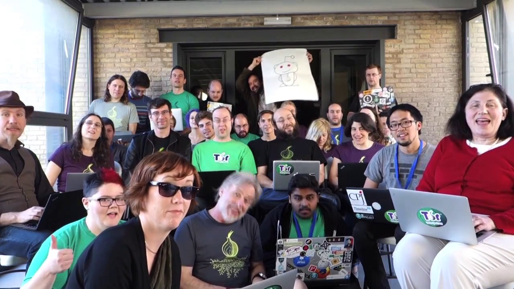
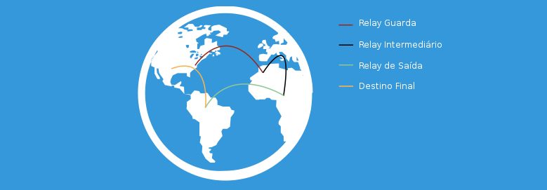
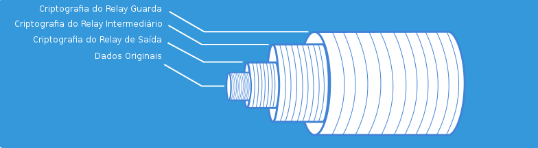
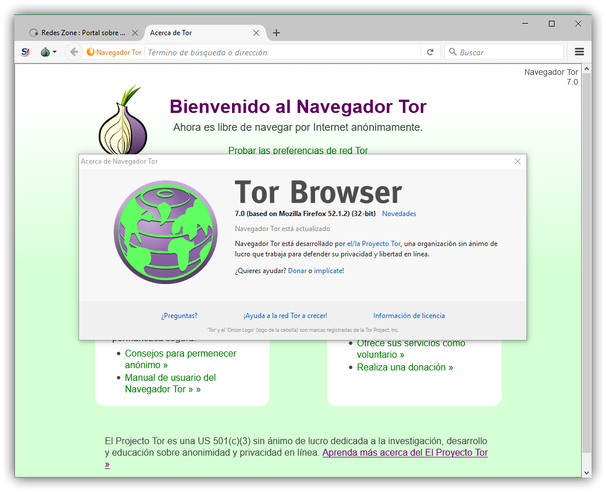

---
layout:		post
title:		Conhecendo e Desmistificando Tor
date:		2018-01-20 16:20:00 +0000
category:	privacidade
tags:		tor
---

_Tor_ (O roteador cebola, do inglês **T**he **o**nion **r**outer), além de ser um [projeto](https://www.torproject.org/) de software livre e com código aberto, pode ser compreendido basicamente como 3 coisas: um protocolo, uma rede, ou um navegador.

  

  * O projeto está registrado como uma organização não governamental, sem fins lucrativos;
  * O [protocolo](https://gitweb.torproject.org/torspec.git/) está definido publicamente em especificações técnicas nos repositórios do projeto;
  * A rede provê à seus usuários a privacidade para acessar/publicar conteúdos/[serviços](https://www.torproject.org/docs/onion-services) diversos;
  * O [navegador](https://www.torproject.org/download/download-easy.html.en) é a porta de entrada mais simples para se ter acesso a rede.

O que é, para que serve e quem usa Tor?
=======================================

O que é?
--------

Por definição do próprio projeto, o termo _Tor_, pode ser definido como uma rede de servidores operados por voluntários que oferecem a seus usuários a possibilidade de permanecerem anônimos e seguros na Internet.

Uma série de túneis virtuais são utilizados/criados entre a conexão originada pelos usuários e os servidores/serviços que eles desejam utilizar através da Internet, de forma a não comprometer a privacidade destes usuários. _Tor_ também age como uma importante ferramenta de combate a censura e filtros de informações que deveriam ser públicas em todo o globo. Além de oferecer a possibilidade de usuários acessarem serviços e conteúdos de forma anônima, ainda é possível publicar e servir conteúdos de forma anônima através dos chamados _"onion services"_ (antigamente conhecidos como _hidden services_). Todos os endereços dentro da rede _Tor_ são identificados por um sufixo `.onion` atrelado ao nome/hash do serviço que o usuário deseja acessar.

Uma pequena cartilha disponibilizada pelo projeto pode ser acessada **[aqui](https://media.torproject.org/misc/2015-03-tor-brochure/tor-brochure-pt-BR.pdf)**.

**O que _NÃO_ é?**

> Praticamente toda a imagem estereotipada que _"Hollywood"_ criou e promoveu em seus filmes onde existiam quaisquer crimes e condutas ilícitas na Internet.
> 
> Uma das maiores ignorâncias ligadas a rede, infelizmente, é essa conexão direta a uma criminalização de seus usuários (e/ou desenvolvedores).
> 
> É, sim, triste e vergonhoso saber que alguns casos existem; entretanto a execução de tais estúpidas ações pode ser realizada mesmo sem que a rede _Tor_ existisse.
> 
> Reflita.

_Tor_ pode ser utilizado em sistemas operacionais Windows, em sistemas baseados no kernel Linux, Mac/OSX e em outros sistemas de linhagem [BSD/UNIX](https://torbsd.org/).

Para que serve?
---------------

Utilizar _Tor_ te protege contra diferentes tipos de ataques ou monitoramentos indesejados; ambos relacionados a análise de tráfego. Esta análise pode servir, por exemplo, para identificar quem está se correspondendo com quem numa rede aberta/pública.

Diversos e diferentes sítios ou portais de comércio eletrônico podem identificar os comportamentos de internautas e, de maneira abusiva, alterar preços e enviar propagandas diferenciadas a seus visitantes (muitos podem, até, bloquear ou redirecionar visitantes para outros portais). Com ajuda do _Tor_ você pode prevenir que seus comportamentos sejam rastreados numa rede pública, ou até mesmo numa rede privada. 

Se você estiver viajando de férias e visitar sua conta de email pessoal através da rede de um hotel/motel/albergue, além de ser possível que pessoas mal intensionadas interceptem seu tráfego, é possível que você comece a receber mensagens indesejadas ou seja abordado nos corredores ou na recepção para ser questionado sobre promoções e outras situações peculiares.

Caso você esteja viajando por continentes ou países que apliquem censura ou monitoramentos excessivos em conteúdos disponíveis na Internet, pode ser que, sem o uso de _Tor_, você não possa sequer ter acesso a suas redes sociais preferidas! Você pode, ainda, ser impedido de ter acesso a seus portais de notícias preferidos ou aquele mensageiro instantâneo que tanto gosta. _Tor_ te ajuda a acessar suas redes sociais, ler suas notícias favoritas e poder manter contato com seus amigos/familiares. 

Quem usa?
---------

  

  * eu;
  * Famílias (preocupadas com a privacidade/segurança dos parentes);
  * Jornalistas e Repórteres;
  * Universidades ou Institutos de Tecnologia;
  * Ativistas e Ciberativistas;
  * Companhias de Pesquisa e Desenvolvimento;
  * Organizações não Governamentais;
  * ...

Porque eu deveria me preocupar em usar Tor?
===========================================

Você ainda têm dúvidas de porque utilizar _Tor_? Provavelmente a mídia e todo um complô formado para denegrir a imagem da rede esteja impedindo que você sequer experimente e usufrua dos benefícios oferecidos (de forma aberta, gratuita e voluntária).

Aqui, um caso compartilhado durante uma apresentação sobre _Tor_:

>  Suponha que você, infelizmente, tenha um parente que esteja a sofrer com algum tipo de doença 
> que lhe forçará a usar seu seguro de saúde e, talvez, se ausentar alguns dias do trabalho. Por algumas 
> poucas vezes, enquanto você estava no trabalho (sem infringir nenhuma condição de acesso a Internet 
> imposta por sua empresa), você pesquisou sobre como deveriam ser os procedimentos ou medicamentos para 
> ajudar no tratamento de seu parente; você está apenas utilizando ferramentas de busca na web para obter 
> algumas informações úteis e até mesmo vitais. Okay? Eis que, um belo dia, você chega no trabalho e 
> descobre que será desligado da empresa! Mas porquê? Durante o processamento de um relatório interno realizado 
> pelo departamento técnico, constatou-se que um dos funcionários estava com um parente doente e a empresa 
> teria de custear alguns benefícios relacionados ao seguro de saúde; você é este funcionário! Este motivo 
> você descobre só depois de já ter perdido seu emprego e estar, quem sabe, sobrevivendo "apenas" do seguro 
> desemprego oferecido em seu país, ou região. Você não desrespeitou ou não saltou através de nenhuma das 
> políticas impostas pela sua empresa. Você apenas acessou conteúdo público, disponível na Internet, e leu 
> algumas páginas especializadas ou blogs. Agora? Realize a dor de cabeça e toda a perda de tempo e energia 
> que você vai ter, lutando contra a empresa que te demitiu e o quanto que você terá de se dispor a faltar 
> no acompanhamento de seu parente doente.
 
Mesmo assim, você ainda está com dúvidas e teme por utilizar ferramentas que te levem a usufruir da rede? Não quer nem baixar e testar o navegador? Certo, aqui vai um outro caso:

>  Refugiadx e lutando para conseguir axilo político, você, que é pai ou mãe de uma criança, quer 
> MUITO entrar em contato com ela para dar notícias de que você está bem e que, se tudo continuar dando certo, 
> em breve vocês poderão estar juntos outra vez e mudar de vida longe do país onde antes se encontravam 
> (longe de guerras, conflitos e, quem sabe, carnificinas propiciadas por brigas religiosas). Com auxílio de _Tor_
> vocês podem se comunicar de forma segura e anônima através da Internet.

Continua com dúvidas ou está parecendo algo muito dubioso? Visite a [biblioteca](https://media.torproject.org/) de mídias do projeto.

Como funciona?
==============

Se você precisa acessar um servidor/serviço na Internet, em resumo, funciona assim:

    Cliente -> Bridge/Relay -> Relay -> Nós de Saída -> Internet

Se você precisa acessar um _onion service_, em resumo, funciona assim:

    Cliente -> Bridge/Relay -> Relay -> ~ -> endereço.onion 

  

Cada salto que você dá para dentro da rede têm sua própria camada de criptografia. O último pulo, para a Internet (se necessário), não sabe de onde a solicitação originalmente veio.

  

### Bridge (Apoio/Ponte)

Uma bridge funciona uma conexão de apoio/ponte para que você consiga realizar o primeiro salto para dentro da rede _Tor_; Bridges são utilizadas quando há uma censura excessiva ou filtros abusivos em sua conexão com a Internet.

Muitas das bridges existentes fazem uso de [obfuscadores de tráfego](https://www.torproject.org/docs/pluggable-transports.html.en). Estes, por sua vez, auxiliam o mascaramento do tipo de tráfego que ocorre entre você e a bridge (seu primeiro salto para dentro da rede).

Por desempenharem funções vitais na rede _Tor_, os endereços IP públicos de bridges não são publicados junto com outros endereços de servidores qeu operam apenas como relays. Entretanto, como toda a rede é aberta e o projeto trabalha da forma mais transparente possível, é possível tem acesso a alguns dos endereços IP e das assinaturas dos servidores bridge (pontes) através da [Base de Dados](https://bridges.torproject.org/) oficial.

### Relay (Rebatedor/Repetidor/Refletor)

Relay é a definição básica de um nó na rede _Tor_.

Algumas documentações referenciam o primeiro salto para dentro da rede como 'Relay de Entrada', 'Relay de Guarda', ou 'Relay Guardião'. Existe, ainda, um ciclo de vida que a rede respeita para eleição dos servidores que devem desempenhar esta função (não são quaisquer novos servidores que podem simplesmente se ligar a rede e operar como guardiões - para maiores detalhes a respeito deste ciclo de vida, uma publicação no blog oficial do projeto está disponível para leitura [aqui](https://blog.torproject.org/lifecycle-new-relay)).

Recebem nomes específicos quando estão operando em funções especiais, como 'Bridge' ou 'Nó de Saída'.

### Nó de Saída

São nós que permitem você sair da rede _Tor_ e chegar até sítios/portais/servidores/serviços hospedados na Internet.

Como utilizar? Como colaborar?
==============================

Mencionada anteriormente, a forma mais simples é a utilização do [navegador](https://www.torproject.org/download/download-easy.html.en) disponibilizado pelo projeto, o **_Tor_ Browser**. Esta é, sem dúvida, a forma mais recomendada para ter seu primeiro contato com _Tor_.

Utilizando
----------

  

O navegador é uma versão customizada do [Mozilla Firefox](https://www.mozilla.org/firefox/) e vem acompanhado do conjunto de bibliotecas e aplicações necessárias para você ter acesso a rede _Tor_ e também conseguir manter sua privacidade no acesso à Internet. Nenhum outro software adicional é necessário, e não é preciso que você instale o navegador; ele pode ser usado logo depois que você obtiver o pacote e descomprimir os arquivos numa pasta de sua preferência.

Para usuários do sistema operacional Android, é possível usar o **Orbot** em conjunto com o **Orfox**! Ambos os aplicativos são gratuitos e de código aberto (assinados pelo [The Guardian Project](https://guardianproject.info/)).

Alternativas para uso do _Tor_ estão descritas no [sítio](https://www.torproject.org/docs/installguide.html.en) oficial e em páginas da [wiki](https://trac.torproject.org/projects/tor/wiki/WikiStart#InstallingandConfiguringTor) do projeto.

Colaborando
-----------

Se você se interessou e quer ajudar, visite a página oficial do projeto, sobre ser [voluntário](https://www.torproject.org/getinvolved/volunteer.html.en).

Caso necessite de guias em português para configuração de bridges e relays, visite o [repositório](https://github.com/torbsd/torbsd.github.io/tree/egypcio/docs/pt) do projeto _TorBSD_.

Você pode, ainda, fazer uma [doação](https://www.torproject.org/donate/donate-button.html.en).
